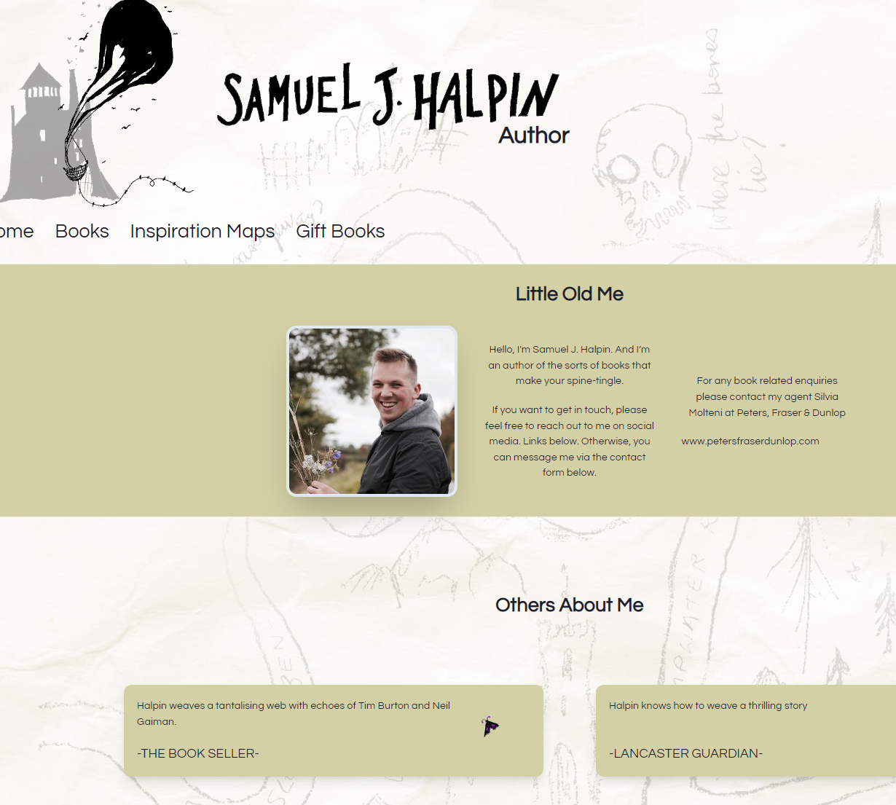
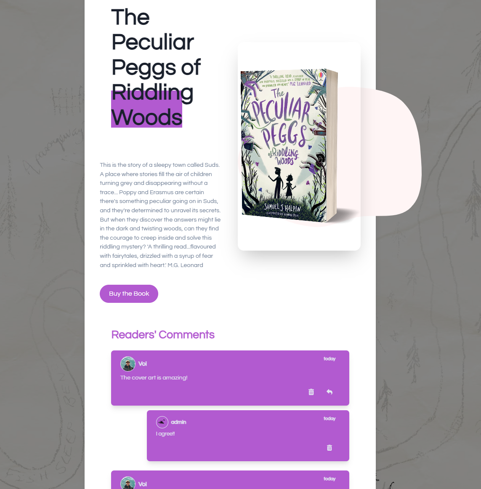
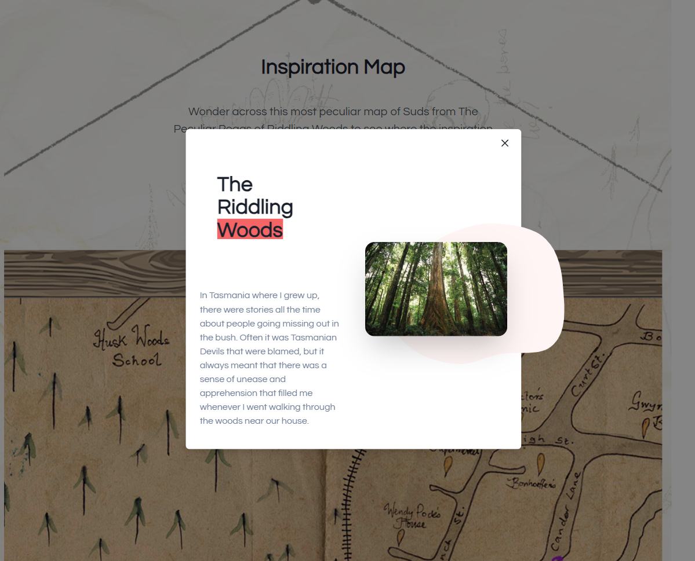
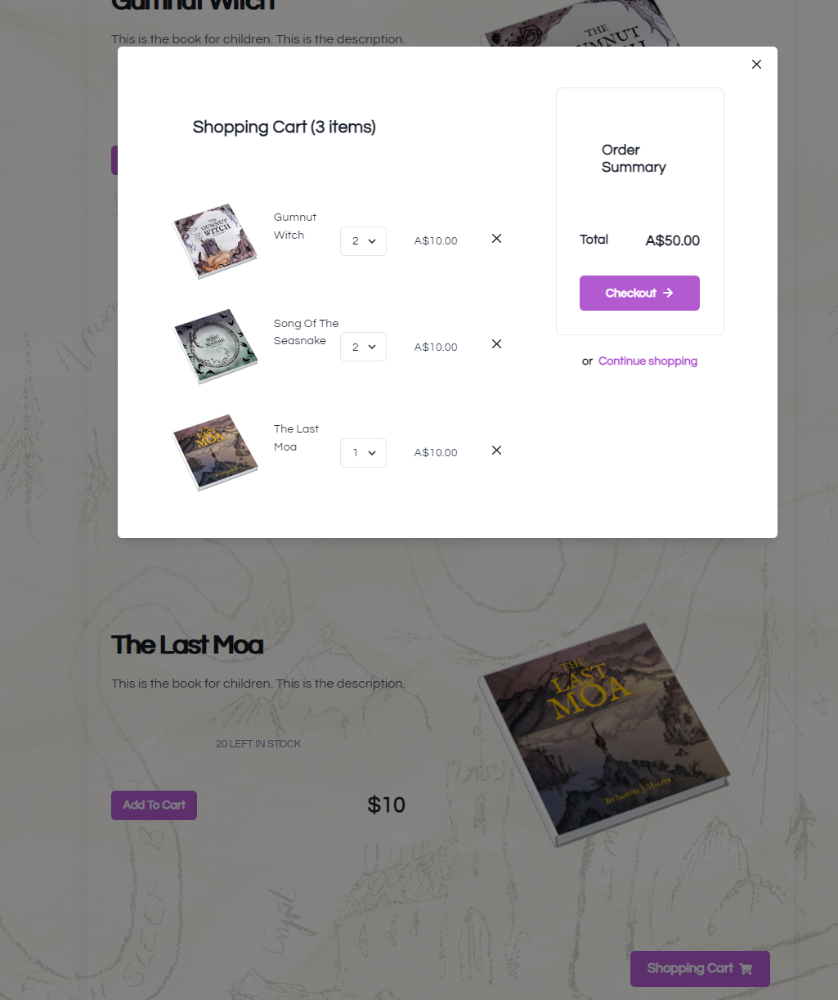

# Samuel J. Halpin's Author Page

## Description

This author's page is a captivating web application designed to showcase the works of a talented Samuel J. Halpin. The platform offers an engaging and interactive experience for users to explore a collection of published books, discover inspirations behind the novels, and even order few unique titles directly from the website.

## Table of Contents

- [Features](#features)
- [Screenshots](#screenshots)
- [Technologies Used](#technologies-used)
- [Usage](#usage)
- [License](#license)
- [Contact and Links](#contact)

## Features

- **Book Showcase**: Browse through the collection of published books, each with captivating descriptions and cover images.
- **Inspiration Map**: Explore a visually-rich map that shows the world in the novel and stories that inspired the author's creative journey.
- **Interactive Comments**: Engage with other readers and the author through interactive comments and discussions on each book's page.
- **Easy Ordering**: Seamlessly place orders for some unpublished books through a convenient shopping cart system.

## Screenshots

Include screenshots or GIFs showcasing the layout and design of your webpage.

## Technologies Used

- React
- Chakra UI
- MongoDB
- jsonwebtoken
- Apollo
- GraphQL
- Redux
- Stripe

## Usage

1. Upon opening the Children's Author Showcase, users are greeted with an enticing "Home" section that features a captivating introduction, somme acclaim for the writer and an inviting image of the author.

2. Navigation is made seamless with a user-friendly menu at the top of the page, allowing users to easily explore different sections.
3. The "Books" section showcases the array of published works, complete with enticing descriptions and visually appealing cover images. Users can engage in interactive comments and discussions with the author and fellow readers.

4. The "Inspiration Map" presents an exciting interactive map of Suds drawn by Samuel. Click on the moths that sit on the map to reveal Sam's inspirations for the novel. If you have more questions to Samuel you can post it underneath the map.

5. The "Gift Books" section provides an opportunity for users to explore exciting merchandise of Samuel's yet unpublished books.

6. Create a new user or log in to be able to enjoy commenting asking questions to the author and placing orders.

## License

This project is licensed under the MIT License. See the [LICENSE](./LICENSE) file for more information.

## Contact and Links

If you have any questions or would like to get in touch, feel free to reach out to me through the following channels:

- GitHub: [github.com/voi-jankowski](https://github.com/voi-jankowski)
- Email: voi.jankowski@gmail.com
- LinkedIn: [linkedin.com/in/voi-jankowski/](https://www.linkedin.com/in/voi-jankowski/)

The page can be accessed [here](https://samuel-j-halpin-5ca11d52cf4b.herokuapp.com/) .

The repository for the project is [here](https://github.com/voi-jankowski/samuel.j.halpin) .
